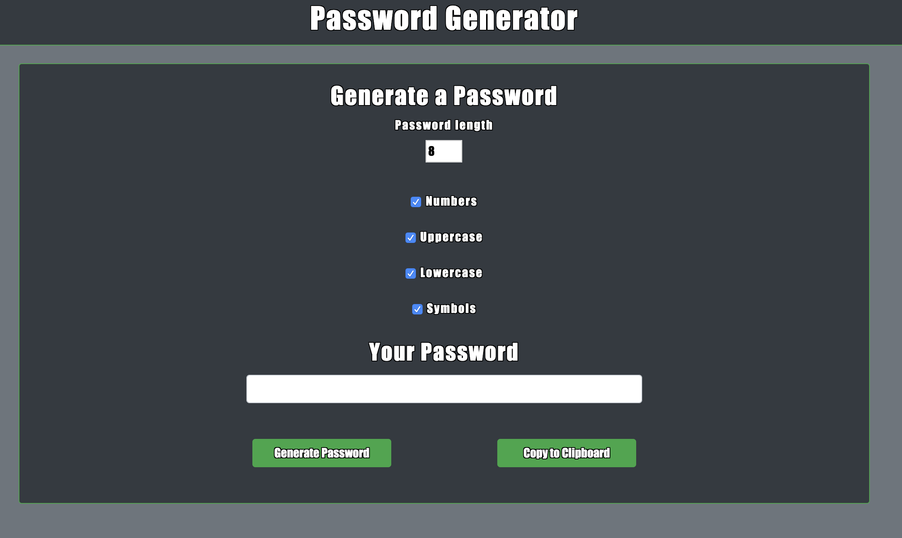
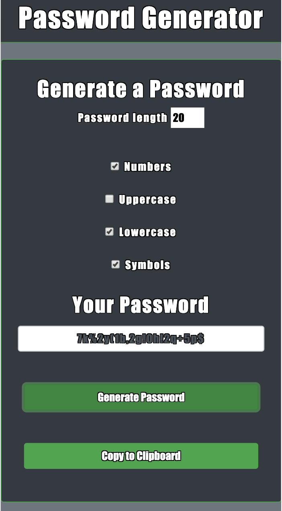

# Password Generator

Here is my password generator. I started with HTML and customized it with CSS using Bootstrap which makes it fully responsive between browser size. The password generator is created with javascript using a mixture of functions, for loops, if statements,  and variables
You can choose between Uppercase, Lowercase, Symbols, or numbers by checking/unchecking the boxes. With a minimum of 8 characters and a max of 128. 

## Test

Check/Uncheck the boxes and change the character amount to test. Generate and Copy to clipboard is fully functioning.

## Deployment

https://rythomas2525.github.io/passwordgenerator/

https://github.com/rythomas2525/passwordgenerator

## Built With

* Visual Studio Code
* Github
* Githubpages

## Authors

Ryan Thomas

